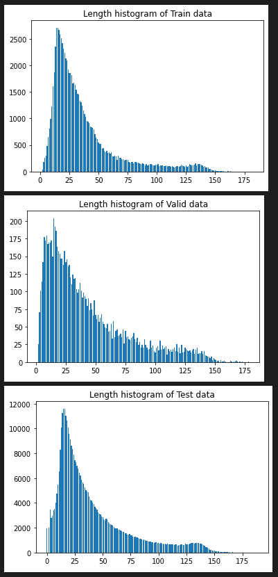
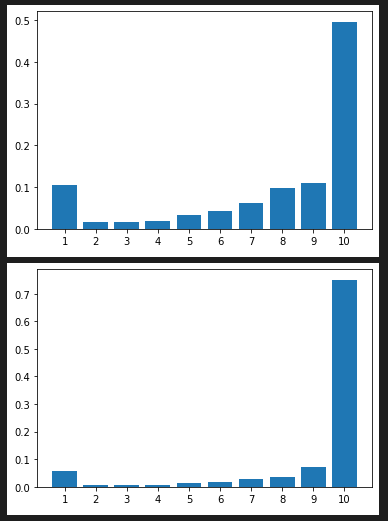
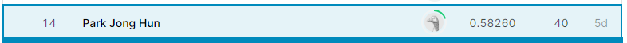
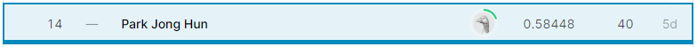

# Algorima - Technical Assignment

## Movie rating prediction (Korean)

- 이 과제는 사용자 리뷰와 평점 쌍의 데이터를 학습하여, 자동으로 사용자의 영화 리뷰 평점을 예측하는 모델을 만드는 것입니다. 한국어 영화 리뷰를 데이터셋으로 사용합니다.

## Solution Strategy

### EDA (Exploratory Data Analysis)

#### Data Processing

- EDA를 통해 모델 학습에 필요하지 않다고 생각되는 점들을 제거, 수정해주었습니다.

1. 불필요한 문장 부호나 자소 단위 문자 제거
2. 반복되는 단어 제거 후 한 단어만 사용
3. 긴 공백 제거
4. 띄어쓰기를 문법에 맞게 수정
5. 맞춤법 검사
6. 리뷰의 문장을 구분하기 위해 문장 구분 후 마침표 표시
7. 중복 데이터 제거
   - 중복된 리뷰, 평점을 가진 데이터를 하나만 남기고 제거해주었습니다.
   - 리뷰 내용이 같지만 평점이 다른 데이터들은 제거 후 학습에 사용하지 않았습니다.

=> 결과적으로 시간이 너무 오래 걸려 5번 맞춤법 검사는 하지 못하였습니다.

#### Train Data Sampling

- 너무 많은 학습 데이터를 전부 학습시키기 어려워서 전체 train data 중 class 분포를 고려한 90000개의 data를 sampling 하여 사용하였습니다.

#### Tokenizer Max Length

- 각 data의 length에 대한 histogram을 그려보았습니다. 그리고 대부분의 data가 50보다 작은 length를 가지고 있기 때문에 tokenizer의 max length를 50으로 설정하여 학습에 사용하였습니다.

#### Zero length data

- length가 0인 data가 존재하였고, 이 data들의 label 분포를 확인한 결과, 10인 경우가 가장 많아서 학습에서 제외시킨 후 length가 0인 data는 전부 10으로 예측하도록 하였습니다.

#### Class Imbalance Problem

- 각 class 별 분포를 확인한 결과 class 10의 data가 다른 class와 비교하여 과하게 많이 분포하였습니다. 따라서 그대로 사용할 경우 class 10으로 model이
  overfitting 될 것을 우려하여 각 class 별로 같은 수의 data를 sampling하여 사용하거나 학습 과정에서 imbalance sampler를 사용하여 해결하려 하였습니다.
- 하지만 결과적으로 class의 imbalance 분포가 존재하는 것이 CV와 LB 모두에서 더 높은 score를 보여 최종 결과에선 사용하지 않았습니다.

### Training & Inference

#### Model

- huggingface의 pre-trianed classification model을 사용하였습니다.

- xlm-roberta-large, koelectra-base-v3-discriminator로 실험하였습니다.

=> model의 size 크기가 더 크기 때문인지 xlm-roberta-large 모델이 더 높은 score를 보였습니다.

#### Loss

- Cross entropy loss
- Focal loss
  > 데이터 수가 적은 class의 학습이 비교적 잘 되지 않는 것 같아, focal loss를 사용하여 이를 해결하려고 시도하였습니다. 
- F1 loss
  > LB의 measure 방법인 f1 score를 loss로 사용하면 더 높은 score를 얻을 수 있다고 판단하였습니다.

=> 최종적으로 cross entropy loss와 f1 loss를 결합한 형태를 학습에 사용하였습니다.
#### Imbalanced Sampler

- class imbalance problem을 해결하기 위해 시도하였습니다.

=> 하지만 결과적으로 class의 imbalance 분포가 존재하는 것이 CV와 LB 모두에서 더 높은 score를 보여 최종 결과에선 사용하지 않았습니다.

#### Scheduler

- get_cosine_with_hard_restarts_schedule_with_warmup
  > huggingface에서 제공하는 get_cosine_with_hard_restarts_schedule_with_warmup를 사용하였습니다.
  > 경험적으로 다른 scheduler보다 gradient exploding 현상이 적어 사용하였습니다.

#### Early Stopping

- 고정된 epoch 수가 아닌 500 step 마다 validation dataset의 f1 score를 측정하여 overfitting 되는 시점에 학습을 종료하였습니다.
#### Weighted probability of class 10

- 실험을 반복한 결과 10번 class로 예측하는 경우가 더 많을수록 높은 score를 보였습니다.
- 따라서 validation dataset과 test dataset의 softmax output에서 10번 class의 확률에만 weight를 추가해주었습니다.
#### k fold cross validation

- 단일 모델로 실험을 반복하여 성능을 높인 후 최종 submission은 10개의 fold를 사용하여 각각의 모델 별로 output을 soft voting 하여 구했습니다.

## Evaluation Matric

- F1 score

## Result

###### Pubilc Score

###### Private Score

## Reference

https://www.kaggle.com/c/technical-assignment-2021-dev
